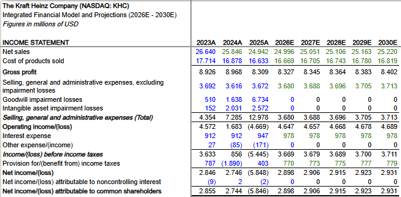
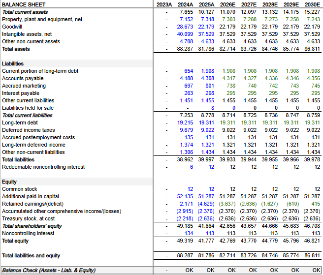
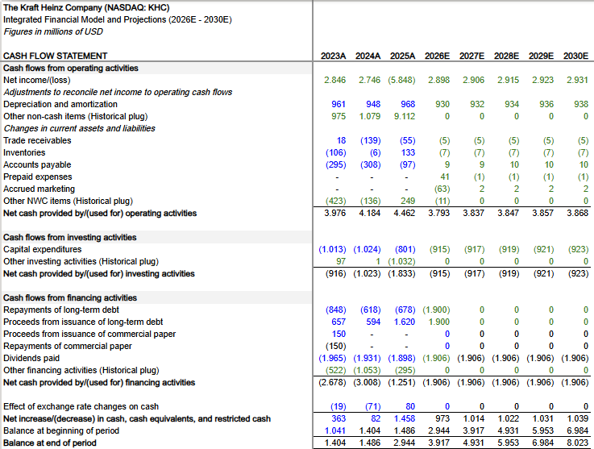

# README: Modelo Financiero Proyectado (2026E-2030E) The Kraft Heinz Company (KHC)
*Read this in [English](README.md)*

[📥 **Descargar el Modelo Financiero en Excel**](https://github.com/jeansebastiannino/KHC-Financial-Model/raw/refs/heads/main/KHC_Integrated_Financial_Model_2026E-2030E.xlsx)
## 1. Introducción y Alcance
Este documento describe la estructura y los supuestos clave de proyección (drivers) del modelo financiero de tres estados para The Kraft Heinz Company (KHC). Este modelo fue desarrollado en Excel con apoyo técnico de IA, utilizando como fuente única de datos históricos el informe presentado ante la SEC, [Annual Report Form 10-K 2025](KHC_Annual_Report_10K_2025.pdf), para el periodo 2023A-2025A. Su propósito es proyectar los estados financieros de la empresa a cinco años (2026E-2030E), cumpliendo con los estándares financieros y asegurando un cuadre perfecto del balance.
### Vistas del Modelo

## 2. Estructura del Modelo
Se implementó un modelo financiero integrado de tres estados, estructurado mediante *Schedules* lógicos y basado en inductores (*driver-based*) para proyectar el desempeño futuro a partir de tendencias históricas, métricas de eficiencia, parámetros regulatorios y ajustes de normalización:

* **Schedules:** Contiene los módulos operativos (Net Sales, Cost of Products Sold, OpEx, Net Working Capital), de capital y financiamiento (CapEx, D&A & PP&E, Debt & Interest, Tax Rate), y de conciliación contable (Retained Earnings, Other Cash Flow Items, Restricted Cash). 
* **Income Statement:** Proyecta la rentabilidad (desde Net Sales hasta Net Income) consolidando los impactos de los schedules operativos y financieros.
* **Balance Sheet:** Refleja la posición financiera (activos, pasivos y patrimonio) integrando un control de cuadre dinámico (Balance Check).
* **Cash Flow Statement:** Concilia la utilidad neta con la generación real de caja mediante el método indirecto, aislando partidas no monetarias y requerimientos de capital.

## 3. Supuestos Clave de Proyección (Drivers)

* **Net Sales:** Proyección de ingresos por segmento a partir del crecimiento anual de ventas netas. Para el segmento North America se fijó un crecimiento *flat* (0.0%) para evitar arrastrar la contracción atípica del último año (-4.90%). Para los segmentos International Developed Markets (0.11%) y Emerging Markets (1.77%), se proyectó el último histórico, ya que sus valores son consistentes con la tasa de crecimiento natural propia de cada mercado.
* **Cost of Products Sold:** Costo directo (COGS) proyectado por segmento como porcentaje de ventas. Se aplica el último histórico (66.69%) para reflejar la estructura actual de costos directos de la empresa, considerando el impacto de la presión inflacionaria observada en 2025A y manteniendo una postura conservadora ante la incertidumbre proyectada para el ejercicio 2026E (p. 28 del 10-K).
* **OpEx:** Proyectado como porcentaje de ventas, se emplea el último histórico (14.72%) para mantener la estructura actual de gastos operativos de la empresa, asegurando la consistencia entre la estabilización de los ingresos netos proyectados y la utilidad operativa. 
* **Net Working Capital:** Proyección de cuentas por cobrar (DSO: 33 días), inventarios (DIO: 69 días) y cuentas por pagar (DPO: 95 días), ancladas al último histórico para reflejar el estado actual del ciclo de conversión de efectivo de la empresa, en relación con las medidas de optimización de inventario y extensión de plazos de pago a los proveedores (pp. 34 y 35 del 10-K), así como el aumento del riesgo futuro de cuentas incobrables y ciclos de cobro más largos (p. 14 del 10-K). Para su cálculo se asume un año comercial de 360 días que promedia los cierres de año fiscal (52/53 semanas) por parte de la empresa. Respecto de los gastos anticipados (1.00%) y marketing devengado (2.95%), se proyectaron como porcentaje de ventas usando promedios históricos para vincularlos, por su naturaleza operativa, al nivel de actividad de la empresa.
* **CapEx, D&A & PP&E:** Proyectados como porcentaje de ventas, usando promedios históricos (3.66% y 3.72% respectivamente) para suavizar tanto la disminución atípica en inversión de bienes de capital como el aumento atípico en su depreciación dados en el año 2025A. El PP&E suma el CapEx y resta la D&A en el roll-forward, para trasladar el saldo neto correcto al Balance Sheet.
* **Debt & Interest:** Para la proyección de la deuda total (corriente y no corriente) de la empresa, se asume en el roll-forward un refinanciamiento del 100% (roll-over), ante el vencimiento en junio de 2026 de $1,900M en notas senior (p. 36 del 10-K), registrando emisiones y repagos simétricos por dicho monto. Para el resto del período se registra una proyección en cero, manteniendo estable la estructura de capital ($21,219M). Para su desglose en el balance, se mantuvo constante el último histórico del 8.99% correspondiente a la porción de corto plazo sobre la deuda total. Asimismo, la tasa de interés implícita (4.61%) se mantuvo estable para proyectar el gasto por intereses ($978M). Los ajustes contables (efectos FX y otras partidas no monetarias) se proyectaron en cero para evitar fluctuaciones irreales. Los intereses por pagar (30.15%) se proyectaron como porcentaje normalizado del gasto por intereses.
* **Tax Rate:** Ante la volatilidad histórica de la tasa impositiva efectiva, se utilizó la tasa impositiva estatutaria de EE. UU. (21.0%) reportada por la empresa (p. 73 del 10-K) para calcular la provisión de impuestos.
* **Retained Earnings:** El saldo proyectado en el roll-forward alimenta directamente las ganancias retenidas en el Balance Sheet. Los dividendos declarados de acciones ordinarias proceden de los históricos proporcionados por la empresa en el estado consolidado del patrimonio (p. 54 del 10-K).
* **Other Cash Flow Items:** Las cuentas secundarias se agruparon como ajustes (*historical plugs*) en los años históricos. Hacia adelante, se proyectaron en cero purificando el flujo proyectado de partidas atípicas o no operativas.
* **Restricted Cash:** El año base 2025A presentaba un descalce de $329M entre el saldo final del Cash Flow Statement y el efectivo líquido del Balance Sheet. Esta diferencia se identificó como efectivo restringido producto de un saldo remanente consolidado de fondos para el pago de beneficios médicos de los empleados mediante fideicomisos. Dicho saldo se registró al cierre del ejercicio en otros activos corrientes (164M) y no corrientes (165M) dentro de los estados financieros consolidados (pp. 57 y 88 del 10-K). Para integrar el modelo, se incorporó este concepto como un anexo constante (*flat*) desde 2026E y se restó directamente del saldo final del flujo, absorbiendo el desbalance y garantizando un cuadre exacto.

---

### Disclaimer
Este modelo tiene fines estrictamente educativos y de demostración para portafolio. No constituye asesoría financiera ni recomendación de inversión sobre The Kraft Heinz Company (KHC). Las proyecciones son escenarios hipotéticos basados en datos históricos públicos. El autor no asume responsabilidad alguna por el uso de este material.
